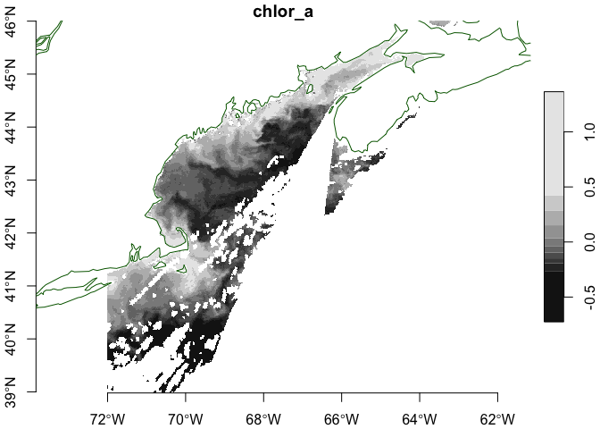

oceancolour
================

This package provides relatively easy access to
[OceanColor](https://www.oceancolour.org/) through it’s
[OPeNDAP](https://www.oceancolour.org/thredds/catalog-cci.html)
resources.

## Requirements

- [R version 4.2+](https://www.r-project.org/)
- [ncdf4](https://CRAN.R-project.org/package=ncdf4)
- [stars](https://CRAN.R-project.org/package=stars)
- [sf](https://CRAN.R-project.org/package=sf)

## Installation

Use the [remotes](https://CRAN.R-project.org/package=remotes) package
from within R.

    remotes::install_github("BigelowLab/oceancolour")

## Usage

The OceanColor products are quit large, so it is handy to be able to
request and download a subset. Here we use a boundign box for the Gulf
of Maine.

We use a
[URL](https://www.oceancolour.org/thredds/dodsC/cci/v6.0-1km-release/geographic/2024/ESACCI-OC-L3S-OC_PRODUCTS-MERGED-1D_DAILY_1km_GEO_PML_OCx_QAA-20240719-fv6.0_1km.nc.html)
we have selected manually.

``` r
suppressPackageStartupMessages({
  library(oceancolour)
  library(rnaturalearth)
  library(ncdf4)
  library(stars)
})

coast = rnaturalearth::ne_coastline(scale = "medium", returnclass = "sf")

url = "https://www.oceancolour.org/thredds/dodsC/cci/v6.0-1km-release/geographic/2024/ESACCI-OC-L3S-OC_PRODUCTS-MERGED-1D_DAILY_1km_GEO_PML_OCx_QAA-20240719-fv6.0_1km.nc"

bb = c(xmin = -72, xmax = -63, ymin = 39, ymax = 46)
var = "chlor_a"

NC = ncdf4::nc_open(url)
```

Now we generate a list that contains defines the bounding box, and us
that to access the data.

``` r
nav = get_nav(NC, bb = bb)
x = get_var(NC, var = var, nav = nav, form = 'stars')
x
```

    ## stars object with 2 dimensions and 1 attribute
    ## attribute(s):
    ##               Min.   1st Qu.    Median     Mean 3rd Qu.     Max.   NA's
    ## chlor_a  0.1883115 0.6751393 0.9098423 1.306367 1.65016 23.15392 455214
    ## dimension(s):
    ##   from  to offset    delta refsys x/y
    ## x    1 867 -72.01  0.01042 WGS 84 [x]
    ## y    1 675  46.01 -0.01042 WGS 84 [y]

And plot…

``` r
plot(log10(x), axes = TRUE, reset = FALSE)
plot(coast, add = TRUE, col = "darkgreen")
```

    ## Warning in plot.sf(coast, add = TRUE, col = "darkgreen"): ignoring all but the
    ## first attribute

<!-- -->

Finally, close the resource.

``` r
ncdf4::nc_close(NC)
```
