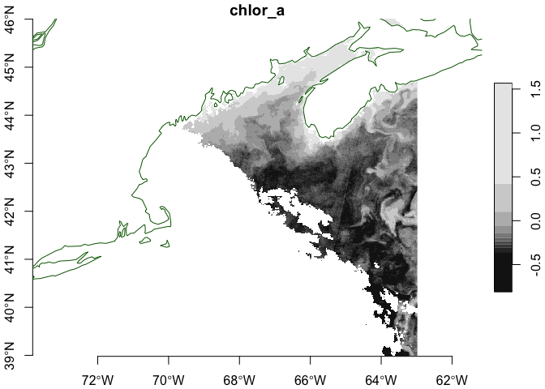
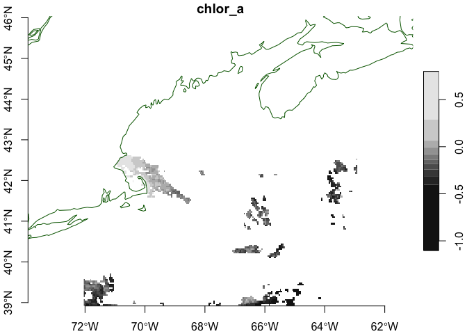

oceancolour
================

This package provides relatively easy access to
[OceanColor](https://www.oceancolour.org/) through it’s
[OPeNDAP](https://www.oceancolour.org/thredds/catalog-cci.html)
resources.

## Requirements

- [R version 4.2+](https://www.r-project.org/)
- [ncdf4](https://CRAN.R-project.org/package=ncdf4)
- [stars](https://CRAN.R-project.org/package=stars)
- [sf](https://CRAN.R-project.org/package=sf)

## Installation

Use the [remotes](https://CRAN.R-project.org/package=remotes) package
from within R.

    remotes::install_github("BigelowLab/oceancolour")

## Usage

The OceanColor products are quit large, so it is handy to be able to
request and download a subset. Here we use a bounding box for the Gulf
of Maine.

We use a
[URL](https://www.oceancolour.org/thredds/dodsC/cci/v6.0-1km-release/geographic/2024/ESACCI-OC-L3S-OC_PRODUCTS-MERGED-1D_DAILY_1km_GEO_PML_OCx_QAA-20240401-fv6.0_1km.nc.html)
we have selected manually. This is a high resolution (~ 1km) daily
composite for just one day.

``` r
suppressPackageStartupMessages({
  library(oceancolour)
  library(rnaturalearth)
  library(ncdf4)
  library(stars)
})

coast = rnaturalearth::ne_coastline(scale = "medium", returnclass = "sf")

url = "https://www.oceancolour.org/thredds/dodsC/cci/v6.0-1km-release/geographic/2024/ESACCI-OC-L3S-OC_PRODUCTS-MERGED-1D_DAILY_1km_GEO_PML_OCx_QAA-20240401-fv6.0_1km.nc"

bb = c(xmin = -72, xmax = -63, ymin = 39, ymax = 46)
var = "chlor_a"

NC1 = ncdf4::nc_open(url)
```

Check out `?get_lon` for a listing of helper functions used to navigate
the object. For example…

``` r
(res1 <- get_res(NC1))
```

    ## [1] 0.01041667 0.01041667

Now we generate a list that contains defines the bounding box, and us
that to access the data. Not we request the output form
[stars](https://r-spatial.github.io/stars/) which is the default. We
could also request “matrix”.

``` r
nav = get_nav(NC1, bb = bb)
x = get_var(NC1, var = var, nav = nav, form = 'stars')
x
```

    ## stars object with 2 dimensions and 1 attribute
    ## attribute(s):
    ##               Min.   1st Qu.    Median     Mean  3rd Qu.     Max.   NA's
    ## chlor_a  0.1546863 0.5124392 0.6403567 1.170733 1.020826 36.91004 422223
    ## dimension(s):
    ##   from  to offset    delta refsys x/y
    ## x    1 867 -72.01  0.01042 WGS 84 [x]
    ## y    1 675  46.01 -0.01042 WGS 84 [y]

And plot…

``` r
plot(log10(x), axes = TRUE, reset = FALSE)
plot(coast, add = TRUE, col = "darkgreen")
```

    ## Warning in plot.sf(coast, add = TRUE, col = "darkgreen"): ignoring all but the
    ## first attribute

<!-- -->

Finally, close the resource.

``` r
ncdf4::nc_close(NC1)
```

### Aggregate data

Aggregate data files are also provided. [This
example](https://www.oceancolour.org/thredds/dodsC/CCI_ALL-v6.0-DAILY.html)
provides an aggregate dataset of daily data for many variables from 1997
to present (lagged by a few months.)

``` r
url = "https://www.oceancolour.org/thredds/dodsC/CCI_ALL-v6.0-DAILY"
NC2 = ncdf4::nc_open(url)
```

Note that the resource has much lower resolution.

``` r
(res2 <- get_res(NC2))
```

    ## [1] 0.04166667 0.04166667

Let’s compare the high resolution example to this…

``` r
res2/res1
```

    ## [1] 4 4

So, the aggregate is about ~4km resolution. But on the plus side it
covers more time…

``` r
summary(get_time(NC2))
```

    ##         Min.      1st Qu.       Median         Mean      3rd Qu.         Max. 
    ## "1997-09-04" "2004-05-16" "2010-12-31" "2010-12-30" "2017-08-16" "2024-04-01"

… and … contains a lot of variables…

``` r
get_varnames(NC2)
```

    ##  [1] "crs"                "MERIS_nobs"         "MODISA_nobs"       
    ##  [4] "OLCI-A_nobs"        "OLCI-B_nobs"        "Rrs_412"           
    ##  [7] "Rrs_412_bias"       "Rrs_412_rmsd"       "Rrs_443"           
    ## [10] "Rrs_443_bias"       "Rrs_443_rmsd"       "Rrs_490"           
    ## [13] "Rrs_490_bias"       "Rrs_490_rmsd"       "Rrs_510"           
    ## [16] "Rrs_510_bias"       "Rrs_510_rmsd"       "Rrs_560"           
    ## [19] "Rrs_560_bias"       "Rrs_560_rmsd"       "Rrs_665"           
    ## [22] "Rrs_665_bias"       "Rrs_665_rmsd"       "SeaWiFS_nobs"      
    ## [25] "VIIRS_nobs"         "adg_412"            "adg_412_bias"      
    ## [28] "adg_412_rmsd"       "adg_443"            "adg_443_bias"      
    ## [31] "adg_443_rmsd"       "adg_490"            "adg_490_bias"      
    ## [34] "adg_490_rmsd"       "adg_510"            "adg_510_bias"      
    ## [37] "adg_510_rmsd"       "adg_560"            "adg_560_bias"      
    ## [40] "adg_560_rmsd"       "adg_665"            "adg_665_bias"      
    ## [43] "adg_665_rmsd"       "aph_412"            "aph_412_bias"      
    ## [46] "aph_412_rmsd"       "aph_443"            "aph_443_bias"      
    ## [49] "aph_443_rmsd"       "aph_490"            "aph_490_bias"      
    ## [52] "aph_490_rmsd"       "aph_510"            "aph_510_bias"      
    ## [55] "aph_510_rmsd"       "aph_560"            "aph_560_bias"      
    ## [58] "aph_560_rmsd"       "aph_665"            "aph_665_bias"      
    ## [61] "aph_665_rmsd"       "atot_412"           "atot_443"          
    ## [64] "atot_490"           "atot_510"           "atot_560"          
    ## [67] "atot_665"           "bbp_412"            "bbp_443"           
    ## [70] "bbp_490"            "bbp_510"            "bbp_560"           
    ## [73] "bbp_665"            "chlor_a"            "chlor_a_log10_bias"
    ## [76] "chlor_a_log10_rmsd" "kd_490"             "kd_490_bias"       
    ## [79] "kd_490_rmsd"        "total_nobs"         "water_class1"      
    ## [82] "water_class10"      "water_class11"      "water_class12"     
    ## [85] "water_class13"      "water_class14"      "water_class2"      
    ## [88] "water_class3"       "water_class4"       "water_class5"      
    ## [91] "water_class6"       "water_class7"       "water_class8"      
    ## [94] "water_class9"

Let’s get the same date (2024-04-01) to compare.

``` r
nav = get_nav(NC2, bb = bb, time = as.Date("2024-01-01"))
x2 = get_var(NC2, var = "chlor_a", nav = nav)
x2
```

    ## stars object with 2 dimensions and 1 attribute
    ## attribute(s):
    ##                Min.   1st Qu.    Median      Mean  3rd Qu.     Max.  NA's
    ## chlor_a  0.07881736 0.5314901 0.7239814 0.9907133 1.071697 6.306849 35961
    ## dimension(s):
    ##   from  to offset    delta refsys x/y
    ## x    1 219 -72.04  0.04167 WGS 84 [x]
    ## y    1 171  46.04 -0.04167 WGS 84 [y]

``` r
plot(log10(x2), axes = TRUE, reset = FALSE)
plot(coast, add = TRUE, col = "darkgreen")
```

    ## Warning in plot.sf(coast, add = TRUE, col = "darkgreen"): ignoring all but the
    ## first attribute

<!-- -->

Finally, close this resource, too.

``` r
ncdf4::nc_close(NC2)
```
